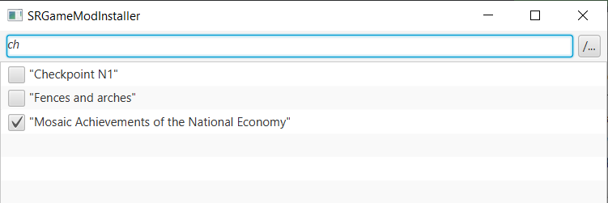

# SRGMInstaller

Программа для установки модов в игру **Workers & Resources: Soviet Republic**.

Моды размещаются в отдельном каталоге, например, "*C:\Mods*". При выделение мода из списка в программе выводится его
описание.
При установке галочки напротив мода - каталог с модом **перемещается** в каталог с игрой "
*ПУТЬ_К_ИГРЕ\media_soviet\workshop_wip*".
При снятии галочки - мод перемещается обратно в каталог с модами, например,  "*C:\Mods*".

Внешний вид программы.

Добавлен интеактивный поиск. При вводе текста программа предложит варианты совпадений.
